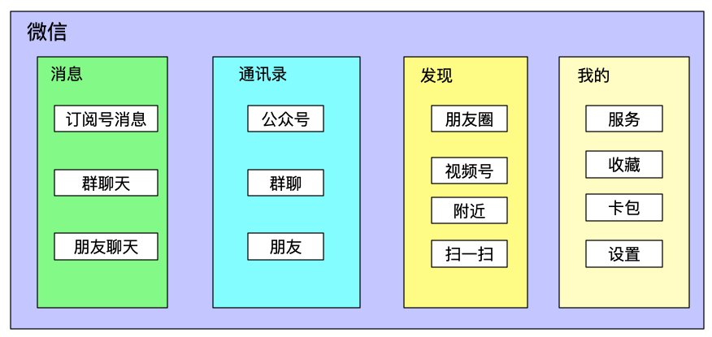
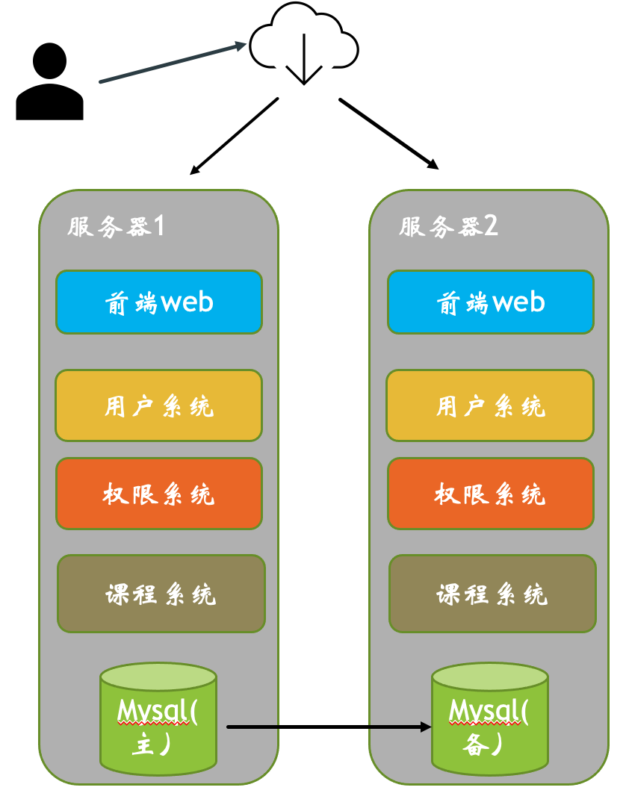
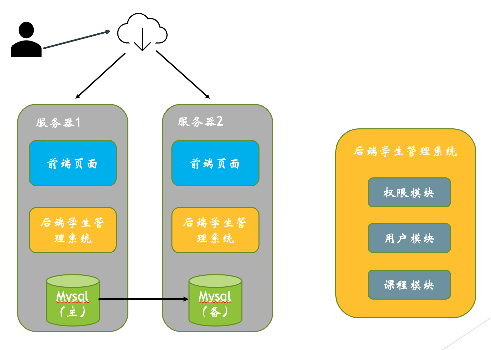

## 微信业务架构图

## 学生管理系统

### 方案1，微服务架构，部署架构图

### 方案2，单体应用，部署架构图

### 方案介绍：

#### 两个方案共同点：

其中前端页面 可以交给PHP developer来写

其余的系统和模块可以交给java developer 来写

都需要两个服务器，一是用来mysql 主备高可用，二是服务的双活高可用

#### 方案1和方案2优缺点：

方案1 把各个模块拆成子系统，微服务化。方案2采用具体应用方式，各个模块放到一个应用里

|      | 方案1                                                        | 方案2                                                        |
| ---- | ------------------------------------------------------------ | ------------------------------------------------------------ |
| 优点 | 1. 采用微服务分离，每个同学写各自的子系统，首先设计好系统接口，然后各自同学就可以去开发了。 2.子系统之间也不会互相影响。利于以后扩展。 | 1. 排查问题简单，只看一个应用系统的日志即可。 2. 部署简单 |
| 缺点 | 1. 排查问题稍显复杂，需要对几个服的日志进行排查。 2. 部署稍显麻烦，需要部署三个服务。 | 1. 因为大家在一套代码上开发，需要大家定时同步开发进度。相互协调的工作更多。 2.由于一个应用的代码过多，应用挂掉的可能性更大。 |
|      |                                                              |                                                              |

#### 复杂度分析

这个架构的复杂度在于，不是高性能，是可扩展，和高可用。

分析如下：

高性能：1000个同学管理，不需要高可用。方案1和2的的可高性能差不多。

可扩展：需要可扩展，一来同学们的时间可能不好协调。方案1的可扩展性好点。

高可用：学生系统，最好不要让人来维护，最好高可用。方案1的可高可用好点。

所以，从复杂度分析，建议方案1微服务架构。

#### 架构三原则

另外从架构三原则，合适，简单，可以演进三个方面考虑

方案1架构合适，基本上算是互联网企业的业务架构雏形，毕设加分

方案1子系统不多，架构也算简单，

方案1也利于演进，可以每个同学负责一个子系统，这样他们也可以根据自己的能力发挥子系统的复杂度，可以更好的答辩。

所以，从架构三原则考虑，建议方案1微服务架构

#### 综上：建议方案1 微服务架构

