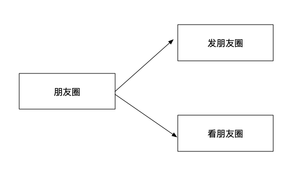
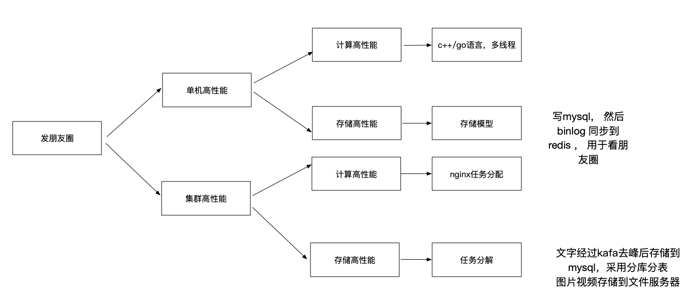
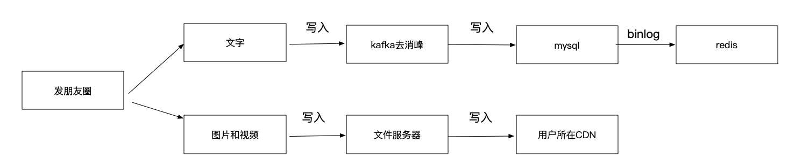
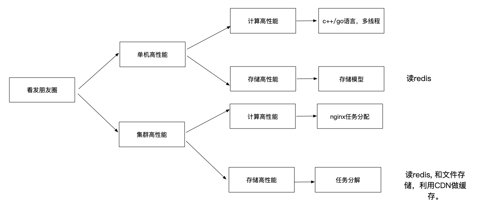

## 微信朋友圈高性能架构设计

### 朋友圈复杂度分析

#### 发朋友圈TPS 2.8万：

TPS ， 微信日活12亿，12亿每天发一条朋友圈的话，12亿/白天12小时/60分 钟/60秒 = 2.8万TPS ，**平均TPS 2.8万**

#### 看朋友圈OPS 2000万

看朋友圈：QPS ，微信日活12亿，那么最高QPS：12亿QPS，一般早，中，晚上的访问量最大，以晚上1小时为例，12亿/60分钟=**2000万 QPS**，

### 朋友圈架构设计

#### 发朋友圈

##### 发朋友圈架构构设计

##### 发朋友圈架构图

##### 设计理由：

朋友圈内容包括文字和 多媒体（图片或者视频），存储采用任务分解的方式，文字落入mysql, 多每天入文件服务器。

文字写入mysql 之前，要通过kafka消峰，落入mysql之后，通过binlog 写入redis 缓存，为看朋友圈提供缓存数据。

多媒体写入文件服务器之后，要把多媒体同步到用户所在CDN，提高用户和其朋友的读朋友圈的性能。

#### 看朋友圈

##### 架构设计

