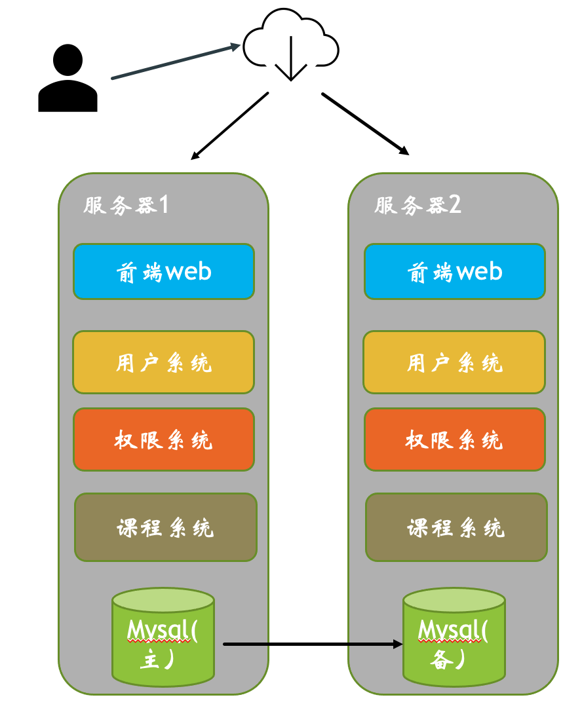

# 前言

本文是学生管理系统架构设计文档，用于指导学生管理系统的开发，测试和运维。

# 词汇表

| 名词     | 释义                           |
| -------- | ------------------------------ |
| 前端web  | 前端接口汇聚层                 |
| 权限系统 | 负责管理用户登陆权限，操作权限 |
| 用户系统 | 记录学生信息                   |
| 课程系统 | 记录课程信息                   |

# 1. 业务背景

学校需要一个web系统来管理 来自动化管理学生的上课，考试。

# 2. 约束和限制

1. 必须在 2022.06.30 号完成

2. 成本不能超过 10 万

3. 数据库采用 mysql

4. 学生，课程数据不能丢失

5. 管理学生人数不超过10万

# 3. 总体架构

## 3.1 架构分析

3.1.1 高可用：

高可用性要求一般。故障恢复时间要求在1天之内。

但是对学生，课程数据不可丢失，这个要求比较高

3.1.2 高性能

高性能要求一般。学校大概有5万学生。使用的系统的QPS 估算在1000qps

3.1.3 可扩展

可扩展要求高，因为学校的需求可能会变化。系统可能会移交其他团队维护，要求系统容易理解，可扩展。

3.1.4 可观测性

要求一般：通过日志可以排查问题即可

3.1.5 可维护性

可维护性要求一般，可以通过登陆机器，重启服务恢复系统即可。

## 3.2 总体架构

采用微服务架构，采用三个子系统：用户系统痛，权限系统，课程系统

1. 前端web为学生管理系统提供界面操作

1. 用户系统：负责学生的录入

2. 课程系统：负责课程的录入

3. 权限系统：复杂不同角色人员的权限管理

4. 数据库采用主备的方式，保证数据可靠性

# 4. 详细设计

## 4.1 核心功能

学生录入功能

## 4.2 关键设计

1. 两台云主机，成本低，双活高可用，每个应用两个副本。

2. nginx 提供负载均很

3. mysql 采用主备方式，保证数据不会丢失。

## 4.3 设计规范

1. API 采用restful风格，https协议

2. MySQL 使用 Innodb 存储引擎

# 5. 质量设计

1. 可测试性：需要日志打印出 access 日志。

2. 可维护性：服务不工作，通过重启服务，即可解决。管理员可以查看所有的学生，课程数据

3. 可观测性：服务的API耗时可以通过access 日志输出。

# 6. 演进规划

一期：

实现学生录入， 和课程浏览

二期：

实现学生自动选课功能