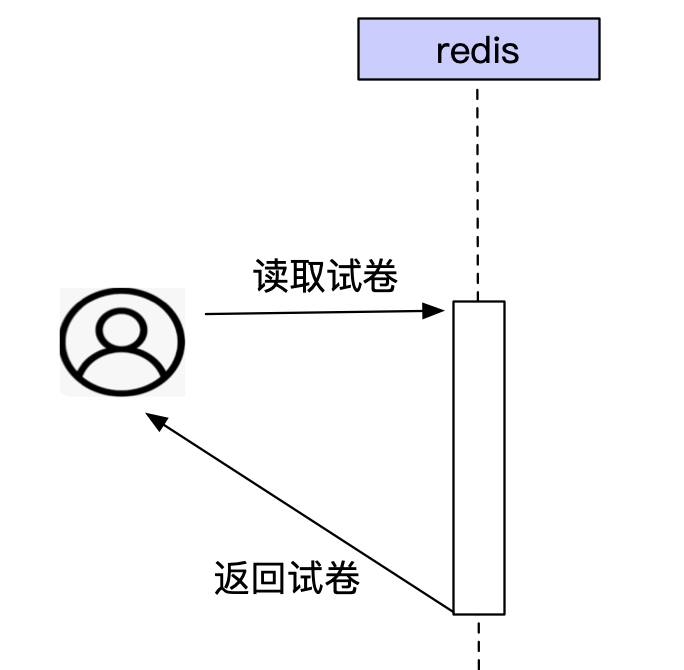

## 作业题目：

基于模块4第6课的估算结果和 Redis sentinel 的初步方案设计，完善考试试卷存储方案，具体包括：

• 完善Redis的数据结构设计，明确具体使用哪种 Redis 数据结构。

• 设计具体的读写流程（可以文字描述也可以序列图描述，序列图要有文字辅助说明）。

• 对照模块4第6课的性能估算结果，计算 Redis sentinel 集群的服务器数量和性能。

## 作业

### 考试模型：20到选择题，20到判断题

### 数据结构：

#### 方案1: redis 采用hashtables 数据结构

例子： 

选择题：key= select,    value: {1: { title：“我们国家有几个省份”, A：22, B: 23,C: 24, D:25 }

判断题：key=judge ,    vaule: “我们国家社会主义吗”

#### 方案2: redis 采用string数据结构：

key = test1， value= "第1题：今天星期几，第2题"

### 服务器数量和性能： 1000万考生同时考试，103台服务器

redis 的单机QPS 大约为10W/S

以高考为例，假设1000万考生 同一天考试。那么数据结构采用方案2，要求的QPS也就是1000w/s   1000w/10w=100台机器，1主加上99个从。加上sentinel 3个机器 ，总共103个机器

### 读写流程：

