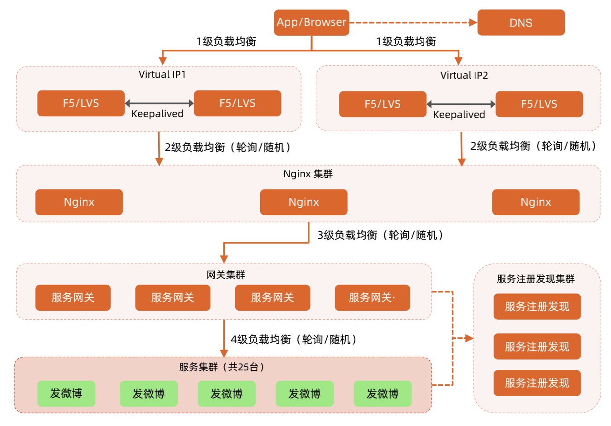
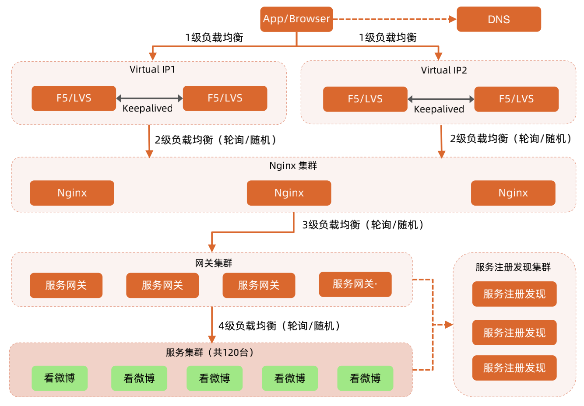
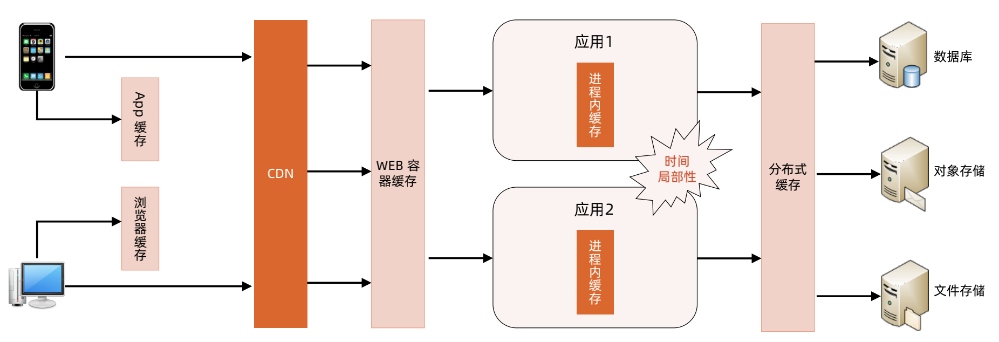
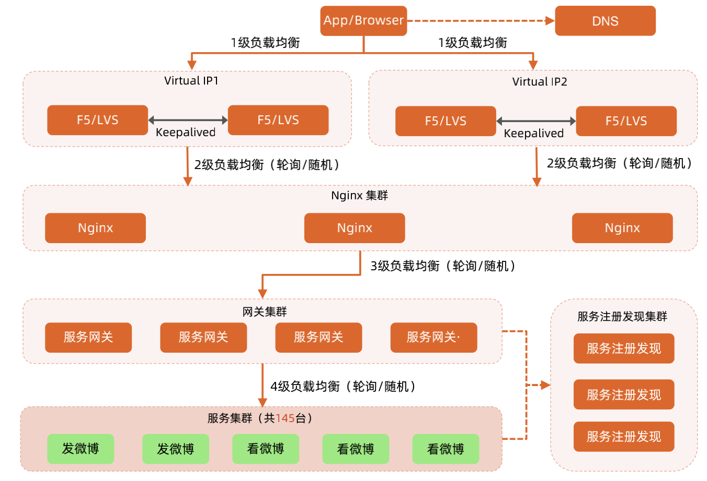
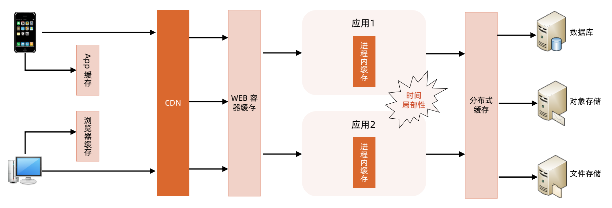
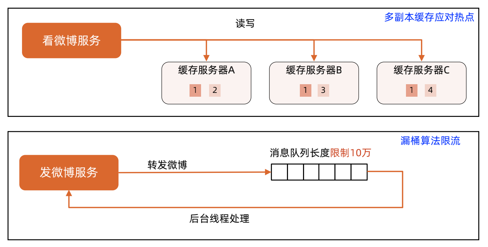

## 估算：

### 用户量

1.2020.9月月活5.11亿，日活2.24亿（参考《微博2020用户发展报告》）。

### 关键行为

发评论

看评论

#### 发评论

考虑到微博是一个看得多发的少的业务，假设平均每天每人发1条评论，则微博每天的发送量约为2.5亿条。

大部分的人发品论集中在早上8：00~9：00点，中午12：00~13：00，晚上20：00~22：00，假设这几个时间段发评论的总量占比为

60%，则这4个小时的平均发评论的 TPS 计算如下：

2.5亿 * 60% / (4 * 3600) ≈ 10 K/s。 

#### 看评论

由于绝大部分微博用户看微博的对象是大V和明星，因此我们假设平均一条微博观看人数有100次，则观看微博的次数为：

2.5亿 * 100 = 250亿。

大部分人看微博的时间段和发微博的时间段基本重合，因此看微博的平均 QPS 计算如下：

250亿 * 60% / (4*3600) = 1000K/s。

## 发评论：

【业务特性分析】

发评论是一个典型的写操作，因此不能用缓存，可以用负载均衡。

【架构分析】

用户量过亿，应该要用多级负载均衡架构，覆盖 DNS -> F5 -> Nginx -> 网关的多级负载均衡。

【架构设计】

1. 负载均衡算法选择

发评论的时候依赖登录状态，登录状态一般都是保存在分布式缓存中的，因此发微博的时候，将请求发送给任意服务器都可以，这

里选择“轮询”或者“随机”算法。

2. 业务服务器数量估算

发评论涉及几个关键的处理：内容审核（依赖审核系统）、数据写入存储（依赖存储系统）、数据写入缓存（依赖缓存系统），因

此按照一个服务每秒处理500来估算，完成10K/s的 TPS，需要20台服务器，加上一定的预留量，25台服务器差不多了。

### 发评论的多级负载均衡架构（参考发微博架构图）

## 看评论：

【业务特性分析】

看微博是一个典型的读场景，由于微博发了后不能修改，因此非常适合用缓存架构，同时由于请求量很大，负载均衡架构也需要。

【架构分析】

1. 用户量过亿，应该要用多级负载均衡架构；

2. 请求量达到250亿，应该要用多级缓存架构，尤其是 CDN 缓存，是缓存设计的核心。

【架构设计】

1. 负载均衡算法选择

游客都可以直接看微博，因此将请求发送给任意服务器都可以，这里选择“轮询”或者“随机”算法。

2. 业务服务器数量估算

假设 CDN 能够承载90%的用户流量，那么剩下10%的读微博的请求进入系统，则请求 QPS 为1000K/s * 10% = 100K/s，由于读取微

博的处理逻辑比较简单，主要是读缓存系统，因此假设单台业务服务器处理能力是1000/s，则机器数量为100台，按照20%的预留量，

最终机器数量为120台。

### 看评论的多级负载均衡架构（参考看微博架构图）

### 看评论的多级缓存架构

## 评论高性能计算方案- 整体架构设计

## 评论的多级缓存整体架构

## 热点事件时的高性能计算架构

### 评论热点事件用户行为建模和性能估算

热点事件指某个大V或者明星爆料或者官宣，虽然只有一两条微博，但引起大量用户在短时间内访问，给系统造成很大压力。

【转发微博】

造成热点事件的微博自己只有1~2条，但是用户围观后会有很多转发，假设有10%的围观用户会在事件发生后60分钟内转发。

【看微博】

很难预估，和事件的影响力和影响范围有关。

### 评论热点事件业务特性分析

【业务特性分析】

1. 发表评论

比较重要，不能丢失

2. 看评论

热点事件发生后，绝大部分请求都落在了导致热点事件发生的那评论上面。

### 评论热点事件计算高可用架构分析（参考看/发微博架构图）

