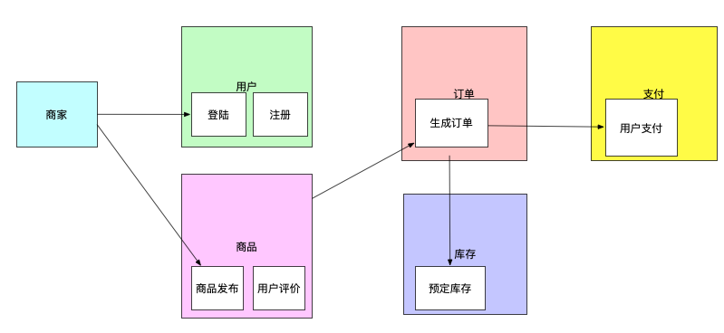

## 题目：拆分电商系统为微服务

假设你现在是一个创业公司的 CTO，开发团队大约30人左右，包括5个前端和25个后端，后端开发人员

全部都是 Java，现在你们准备从0开始做一个小程序电商业务，请你设计微服务拆分的架构以及微服务

基础设施选型。

## 作业：

### 1. 由于后端开发人员都是JAVA， 那么原则spring cloud 作为微服务框架即可，嵌入式SDK。

采用三个火枪手原则，25个 后端，可以分成8个团队，微服务数量大概在8个左右。

### 2. 按照业务流程拆分，可以分为6个领域，8个微服务：

1. 用户：注册服务，登陆服务

2. 商家： 

3. 商品：商品发布， 用户评价 

4. 库存 

5. 订单

6. 支付

### 3. 架构图：

