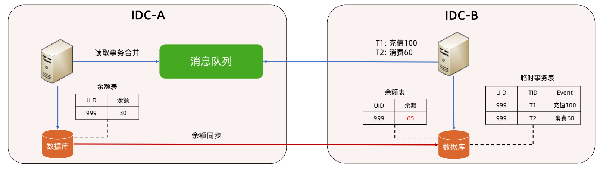
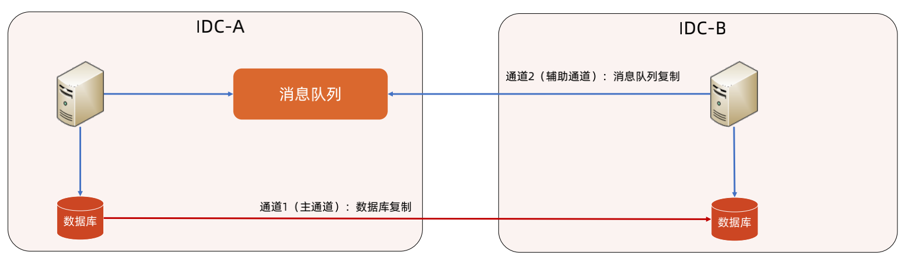

## 题目：

王者荣耀商城异地多活架构设计

【背景】

假设现在决定要实现王者荣耀里面的商城的异地多活架构，请你分析设计一下。

【作业要求】

1. 分析王者荣耀商城的业务特点，设计其异地多活架构；

2. 按照模块7第5课的方法来设计异地多活架构。

【提示】

1. 王者荣耀的商城是虚拟物品商城，和淘宝这种实物电商有两个很大的区别，注意识别出来；

2. 用户要先调用微信钱包或者QQ钱包充值点券，然后在商城里面用点券支付；

3. 用户买英雄和皮肤的时候同样的英雄和皮肤只能买1个，不能重复购买；

4. 用户买鲜花、改名卡之类的道具可以买多个；

5. 分析步骤参考模块7第6课的案例。

## 作业

### 业务背景

#### 业务数据：

2020.11月公布数据，全年日均活跃1亿，注册玩家数6亿，最高同时在线100万

#### 业务功能：

充值点券， 

买英雄和皮肤， 只能买1个

买鲜花等道具，可以买多个

#### 关键业务约束：

钱包或者QQ钱包充值点券，然后在商城里面用点券支付；

买英雄和皮肤， 只能买1个

买鲜花等道具，可以买多个

### 设计步骤1:业务分级：

商城的业务包括，都很重要

##### 1. 充值点券， 不能丢失

##### 2. 买英雄和皮肤， 只能买1个

##### 3. 买鲜花等道具，可以买多个

### 设计步骤2 - 数据分类

#### 充值点券：

1. 充值点卷动作 
2. 不能丢失。

#### 买英雄和皮肤：

1. 用户的英雄和皮肤和信息， 只能买一次，具有唯一性，数据库同步即可。如果没有同步完成，则在异地看不到。影响少数用户。

#### 鲜花和道具：

1. 用户鲜花和道具可以有多个，经常会有增，删，改。

### 设计步骤3- 数据同步

#### 充值点券：事物合并

事物合并，可以保证用户点券最终一致性。

#### 英雄和皮肤：具有全局唯一性，数据库复制

主通道：数据库复制

辅助通道：消息队列复制

#### 鲜花和道具：

同用户点券，采用事物合并，保证最终一致性。

### 设计步骤4- 异常处理

1. 充值过程中失败

   再重试一次

2. 购买的英雄和皮肤，为及时同步到异地机房

​       恢复再看

3. 购买的鲜花和道具的信息 没有及时同步到异地机房